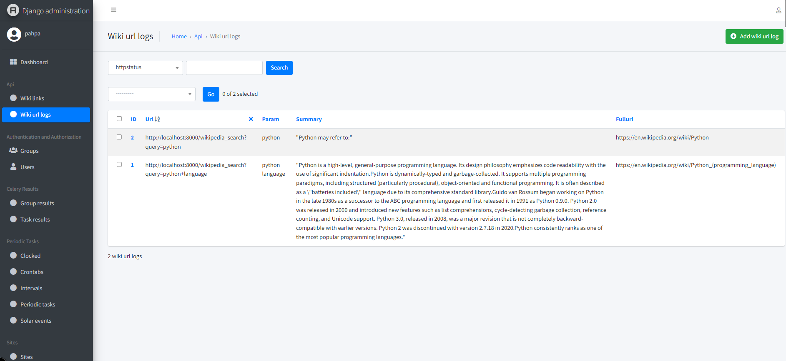
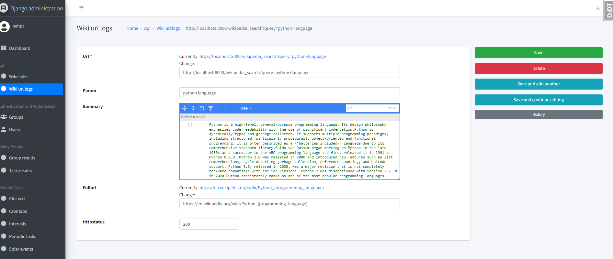
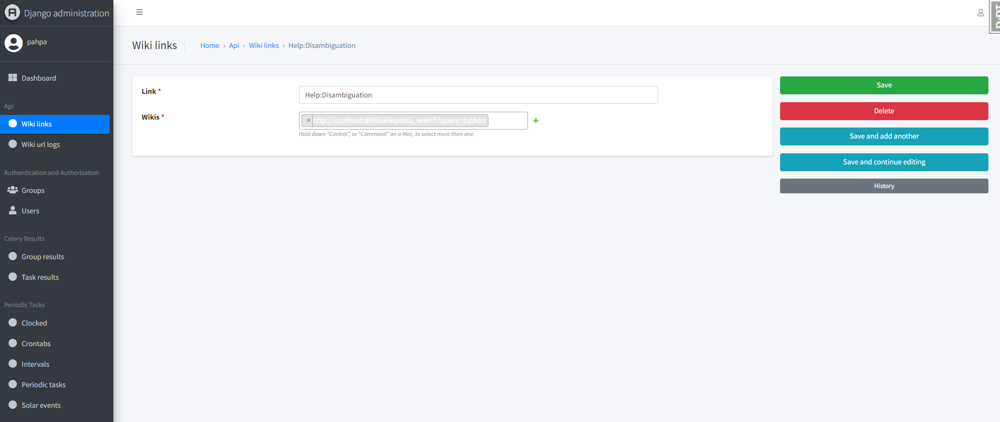
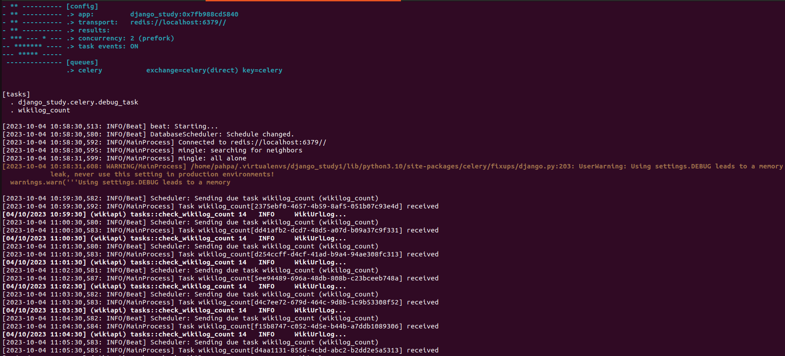

PYTHON TEST

# Self-training in Django by example
* The purpose of this repo is to try to help, many thanks to the Python Django community

## Objective
* Present a project in Python Django with search integration via Wikipedia's APIs
- https://www.djangoproject.com
- https://wikipedia-api.readthedocs.io

## Installation of your **python 3.10** development environment
* Creation of a python3.10+ env either by venv module or by virtualenv wrapper (https://virtualenvwrapper.readthedocs.io/en/latest/install.html)
- venv in 3.10.6 for my part under wsl2 (https://docs.microsoft.com/fr-fr/windows/wsl/install)
* clone the project (https://github.com/pahpa/django-study)
* pip install -r requirements-tests.txt
* python manage.py migrate
* Creation of an internal superuser
```console
cat <<EOF | python manage.py shell
from django.contrib.auth import get_user_model
User = get_user_model()
User.objects.filter(username='pahpa').exists() or \
User.objects.create_superuser('pahpa', 'pahpa@pahpa.dev', 'pahpa1234')
EOF
```
* coverage run --source='.' manage.py test
* coverage report
* make runserver
* make celery-run (launch celery in interactive otherwise celeryd-run in daemon mode)
* make createdatatests (will create 1 game of a few words)
* http://localhost:8000 (launching django dev server 'localhost:8000')
* http://localhost:8000/admin (admin access interface, using the 'pahpa' account you created before)
* http://localhost:8000/swagger/docs (interface swagger REST API, test de django_ninja)
* to kill the celery daemon: make celery-kill
* to follow the celery log: tail -f /var/tmp/wiki_c.log

## paHpa (Procedure)

* My work philosophy has always been sharing, reuse
* For many years, I have used the admin app a lot for the backoffice and for this I have put a theme, others exist with
more advanced widgets.

1. List of logs Research Wiki

2. Detail of a research Wiki log

3. List a page's Wikilog link

4. Detail of the Wikilog links of a page


* I used the celery server for the recurring task of testing the number of urls in the database (no rabbitmq, but redis)
(that of checking the number of links of a page > 100)
* Celery in Console mode while running a task (https://docs.celeryq.dev/en/stable/)

* Admin Celery via Django (https://docs.celeryq.dev/en/stable/django/first-steps-with-django.html)

1. Creating a one minute crontab (https://django-celery-beat.readthedocs.io/en/latest/):
- List des configurations crontab

- Configuration detail


2. Activation task:
- List des tasks

- Detail of a task


3. Result task (https://django-celery-results.readthedocs.io/en/latest/):
- List of task results

- Detail of a task result


* Application django_study (http://localhost:8000/)

1. Main Screen

- In the input box put a word, a search phrase, a synchronous search action on wikipedia will be executed
(the best being to have 1 async action with progress info or celery-progress)
- An automatic refresh of the screen will be done
- You can click on the link if the search was successful (Code 200) otherwise a 404 code for a page not found
- Test game generate words, url, return code randomly without any wikipedia access

2. Detail Link


## paHpa (My Settings Choices)

```
INSTALLED_APPS = [
'jazzmin',
'django.contrib.admin',
'django.contrib.auth',
'django.contrib.contenttypes',
'django.contrib.sessions',
'django.contrib.sites',
'django.contrib.messages',
'django.contrib.staticfiles',

'rest_framework',
'django_extensions',
'django_tables2',
'debug_toolbar',
'jsoneditor',
'django_celery_results',
'django_celery_beat',

'wikisearch',
]
```

- jazzmin for a django admin theme
- rest_framework for the json serializer because I wanted to do 1 clean json return and generate a form but it was for pure pleasure, I
don't use it
- django_extensions l'extension indispensable pour django
- django_tables2, not being gifted in html, I like to be helped by APIs
- debug_toolbar essential debug front tools for the dev
- jsoneditor json field frankly at the top
- django_celery_results le retour des task celery en database
- django_celery_beat scheduler, admin task celery
- api the business app

- Good Test

## paHpa (relational graph of models)

- sudo apt install libgraphviz-dev
- sudo apt install graphviz

- generation dot or png file of the model groups of our project:
```
./manage.py graph_models --pygraphviz -a -g -o docs/images/models_wikisearch.png
```


## paHpa (Using swagger)

- using django-ninja (https://django-ninja.rest-framework.com/)
- accessible for wikilogs list and search (http://localhost:8000/api/swagger/docs)


