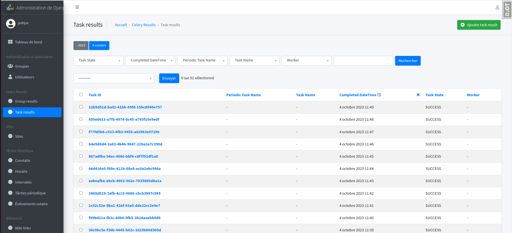
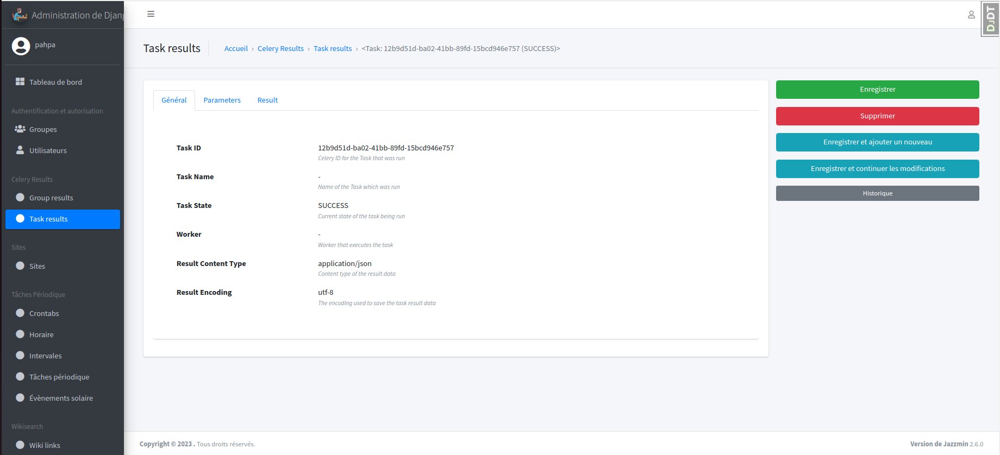
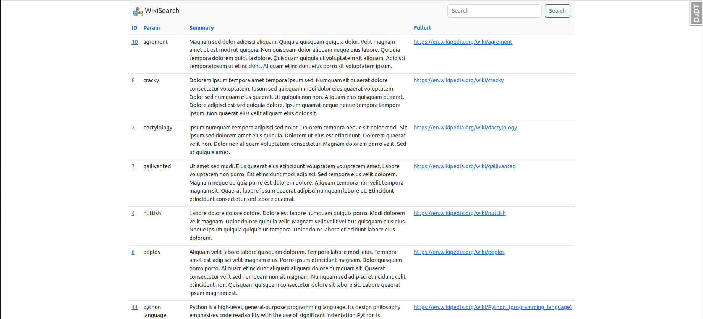

PYTHON TEST

# Self-training in Django by example
*The goal of this repo is to try to help, many thanks to the Python Django community

## Objective
* Present a project in Python Django with search integration via Wikipedia's APIs
- https://www.djangoproject.com
- https://wikipedia-api.readthedocs.io

## Installing your **python 3.10** development environment
* Creation of a python3.10+ env either by the venv module or by virtualenv wrapper (https://virtualenvwrapper.readthedocs.io/en/latest/install.html)
- venv in 3.10.6 for me under wsl2 (https://docs.microsoft.com/fr-fr/windows/wsl/install)
* clone of the project (https://github.com/pahpa/django-study)
* sudo apt install graphviz-dev
* sudo apt install translate-shell
* pip install -r requirements-tests.txt
* python manage.py migrate
* Creation of an internal superuser
```console
cat <<EOF | python manage.py shell
from django.contrib.auth import get_user_model
User u003d get_user_model()
User.objects.filter(usernameu003d'pahpa').exists() or \
User.objects.create_superuser('pahpa', 'pahpa@pahpa.dev', 'pahpa1234')
EOF
```
* coverage run --sourceu003d'.' manage.py test
* coverage report
* make runserver
* make celery-run (launch celery interactively otherwise celeryd-run in daemon mode)
* make createdatatests (will create a set of a few words for you)
* http://localhost:8000 (launching django dev server 'localhost:8000')
* http://localhost:8000/admin (admin access interface, use of the 'pahpa' account that you created before)
* http://localhost:8000/swagger/docs (interface swagger REST API, test de django_ninja)
* to kill the celery daemon: make celery-kill
* to follow the celery log: tail -f /var/tmp/wiki_c.log

## paHpa (Progress)

* My work philosophy has always been sharing, reuse
* For many years, I have used the admin app a lot for the back office and for this I have put a theme, others exist with
more advanced widgets.

1. List of search Wiki logs

2. Details of a search Wiki log

3. List of Wikilog links on a page

4. Details of Wikilog links on a page


* I used the celery server for the recurring task of testing the number of urls in the database (not rabbitmq, but redis)
(that of checking the number of links on a page > 100)
* Celery in Console mode during the execution of a task every 60 seconds (https://docs.celeryq.dev/en/stable/)
- This will be automatically created when the django server starts

* Admin Celery via Django (https://docs.celeryq.dev/en/stable/django/first-steps-with-django.html)

1. Interval:
- List interval

- Interval detail


2. Periodic task:
- List des tasks

- Details of a task


3. Result task (https://django-celery-results.readthedocs.io/en/latest/):
- List of task results

- Details of a task result


* Application django_study (http://localhost:8000/)
- Please forgive me for my excellent Front-End display :)

1. Main Screen

- In the input box put a word, a search phrase, a synchronous search action on Wikipedia will be executed
(the best being to have 1 async action with progress info or celery-progress)
- An automatic refresh of the screen will be done
- You can click on the link if the search was successful (Code 200) otherwise a 404 code for a page not found
- The test game generates words, url, return code randomly without any access to Wikipedia

2. Detail Link


## paHpa (My Choice Settings)

```
INSTALLED_APPS u003d [
'jazzmin',
'django.contrib.admin',
'django.contrib.auth',
'django.contrib.contenttypes',
'django.contrib.sessions',
'django.contrib.sites',
'django.contrib.messages',
'django.contrib.staticfiles',

'rest_framework',
'django_extensions',
'django_tables2',
'debug_toolbar',
'jsoneditor',
'django_celery_results',
'django_celery_beat',

'wikisearch',
]
```

- jazzmin for a django admin theme
- rest_framework for the json serializer because I wanted to make 1 clean json return and generate a form but it was for pure pleasure, I
don't use it for me
- django_extensions the essential extension for django
- django_tables2, not being good at html, I like to get help from APIs
- debug_toolbar front-end debug tools essential for dev
- jsoneditor json field frankly at the top
- django_celery_results the return of task celery to the database
- django_celery_beat scheduler, admin task celery
- api the business app

- Good Test

## paHpa (relational graph of models)

- sudo apt install libgraphviz-dev
- sudo apt install graphviz

- generation of dot or png files of groups of models of our project:
```
./manage.py graph_models --pygraphviz -a -g -o images/models_wikisearch.png
```


## paHpa (Using swagger)

- use of django-ninja (https://django-ninja.rest-framework.com/)
- accessible for listing and searching wikilogs (http://localhost:8000/swagger/docs)


## paHpa (Docker)

- https://blog.logrocket.com/dockerizing-django-app/
```
docker kill django-study || true
docker rm -f django-study || true
docker image rm -f django-study:0.0.0 || true
docker build . -t django-study:0.0.0
docker run --name django-study -p 127.0.0.1:8000:8000 django-study:0.0.0
```
