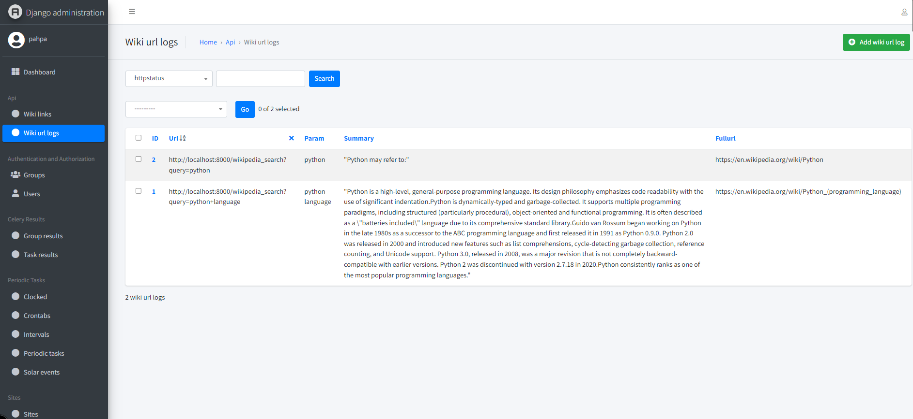
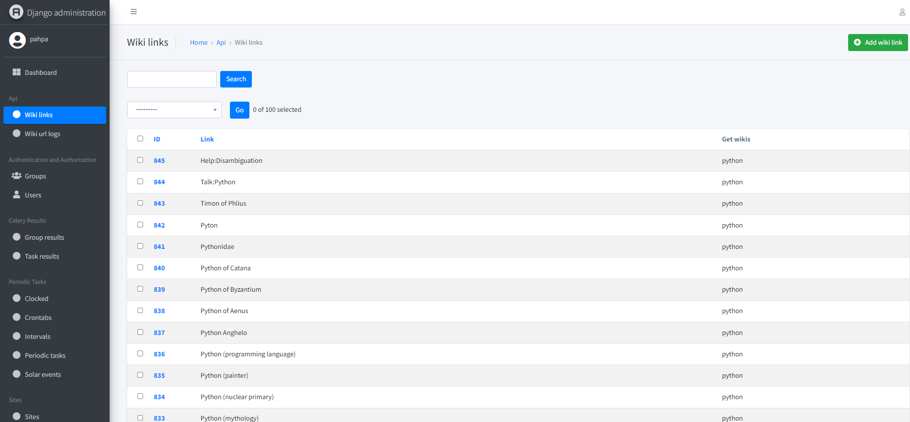
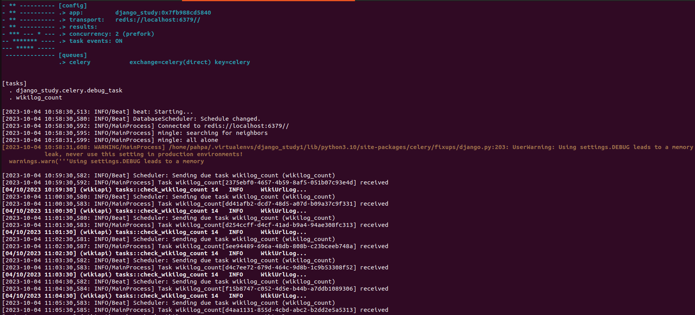

PYTHON TEST

# Autoformation à Django par l'exemple
* L'objectif de ce repo est d'essayer d'aider, un grand merci à la communauté Python Django

## Objectif
* Présenter un projet en Python Django avec une intégration de recherche via les API's Wikipedia
  - https://www.djangoproject.com
  - https://wikipedia-api.readthedocs.io

## Installation de votre environnement **python 3.10** de développement
* Création d'un env python3.10+ soit par le module venv ou par virtualenv wrapper (https://virtualenvwrapper.readthedocs.io/en/latest/install.html)
  - venv en 3.10.6 pour ma part sous wsl2 (https://docs.microsoft.com/fr-fr/windows/wsl/install)
* clone du projet (https://github.com/pahpa/django-study)
* pip install -r requirements-tests.txt
* python manage.py migrate
* Création d'un superuser interne
```console
cat <<EOF | python manage.py shell
from django.contrib.auth import get_user_model
User = get_user_model()
User.objects.filter(username='pahpa').exists() or \
    User.objects.create_superuser('pahpa', 'pahpa@pahpa.dev', 'pahpa1234')
EOF
```
* coverage run --source='.' manage.py test
* coverage report
* make runserver
* make celery-run (lancement de celery en interactif sinon celeryd-run en mode démon)
* make createdatatests (va vous creer 1 jeu de quelques mots)
* http://localhost:8000 (lancement du serveur de dev django 'localhost:8000')
* http://localhost:8000/admin (interface d'acces admin, utilisation du compte 'pahpa' que vous avez créé avant)
* http://localhost:8000/swagger/docs (interface swagger REST API, test de django_ninja)
* pour supprimer le démon celery : make celery-kill
* pour suivre le log celery : tail -f /var/tmp/wiki_c.log

## paHpa (Déroulement)

* Ma philosophie de travail à toujours été le partage, la réutilisation
* Depuis de nombreuses années, j'utilise beaucoup l'app admin pour le backoffice et pour cela j'ai mis un thème, d'autres existent avec
des widgets plus poussés.

  1. List des log Wiki de recherche
  
  2. Détail d'un log Wiki de recherche
  
  3. List des link Wikilog d'une page
  
  4. Détail des link Wikilog d'une page
  

* J'ai utilisé le serveur celery pour la tâche récurrente de test sur le nombre d'url en base de données (pas de rabbitmq, mais redis)
  (celle de check le nombre de link d'une page > 100)
* Celery en mode Console durant l'exécution d'une task (https://docs.celeryq.dev/en/stable/)
  
* Admin Celery via Django (https://docs.celeryq.dev/en/stable/django/first-steps-with-django.html)

  1. Création d'une crontab d'une minute (https://django-celery-beat.readthedocs.io/en/latest/):
    - List des configurations crontab
    
    - Détail de la configuration
    
    
  2. Activation task:
    - List des tasks
    
    - Detail d'une task
    
    

  3. Result task (https://django-celery-results.readthedocs.io/en/latest/): 
    - List des résultats des tasks
    
    - Détail d'un résultat d'une task
    

* Application django_study (http://localhost:8000/)
  
  1. Ecran Principal
    
    - Dans la zone de saisie mettre un mot, une phrase de recherche, une action synchrone de recherche sur wikipedia sera exécutée
    (le mieux étant d'avoir 1 action async avec info de progression ou celery-progress)
    - Un rafraichissement automatique de l'écran sera fait
    - Vous pouvez cliquer sur le lien si la recherche à abouti (Code 200) sinon un code 404 pour une page non trouvée
    - Le jeu de test génére des mots, url, code de retour aléatoirement sans aucun accès à wikipedia
  
  2. Lien Détail
    

## paHpa (Mes Choix Settings)

  ```
  INSTALLED_APPS = [
    'jazzmin',
    'django.contrib.admin',
    'django.contrib.auth',
    'django.contrib.contenttypes',
    'django.contrib.sessions',
    'django.contrib.sites',
    'django.contrib.messages',
    'django.contrib.staticfiles',
    
    'rest_framework',
    'django_extensions',
    'django_tables2',
    'debug_toolbar',
    'jsoneditor',
    'django_celery_results',
    'django_celery_beat',
    
    'wikisearch',
  ]
  ```

  - jazzmin pour un thème admin django
  - rest_framework pour le serializer json car je voulais faire 1 retour propre json et générer une form mais c'était par pur plaisir, je
  ne m'en sert pas
  - django_extensions l'extension indispensable pour django
  - django_tables2, n'etant pas doué en html, j'aime me faire aider par des API
  - debug_toolbar outils front de debug indispensable pour le dev
  - jsoneditor champ json franchement au top
  - django_celery_results le retour des task celery en database
  - django_celery_beat scheduler, admin task celery
  - api l'app metier

- Bon Test
  
## paHpa (graphique relationnel des models)

- sudo apt install libgraphviz-dev
- sudo apt install graphviz

- génération fichier dot ou png des groupes de models de notre projet:
  ```
  ./manage.py graph_models --pygraphviz -a -g -o docs/images/models_wikisearch.png
  ```
  

## paHpa (Utilisation de swagger)

- utilisation de django-ninja (https://django-ninja.rest-framework.com/)
- accessible pour la liste et la recherche des wikilogs (http://localhost:8000/swagger/docs)
  
  

## paHpa (Docker)

- https://blog.logrocket.com/dockerizing-django-app/
  ```
  docker kill django-study || true
	docker rm -f django-study || true
	docker image rm -f django-study:0.0.0 || true
	docker build . -t django-study:0.0.0
	docker run --name django-study -p 127.0.0.1:8000:8000 django-study:0.0.0
  ```
